<div align="center">



# 🧬 SKINSKILL
### **The Ultimate Agentic OS for Developers**

[]()
[]()
[]()
[]()

**Stop babysitting your AI. Start building products.**  
*SkinSkill is the autonomous engine that turns Claude, Cursor, Windsurf, and Gemini into senior engineers — featuring neural memory, self-healing terminals, UI DNA extraction, and a document engine. All via MCP.*

[Explore the Roadmap](ROADMAP.md) • [Report a Bug](https://github.com/corefusiion/SkinSkill/issues) • [Join the Community](#)

</div>

---

## 🛑 The Problem: Your AI is Blind and Forgetful
Claude, Cursor, and Gemini cannot see your local machine and lose context with every new session. You spend 30% of your day translating your project architecture into prompts, pasting terminal errors, and starting every chat from zero.

## 💡 The Solution: Eyes, Hands, and a Neural Brain
SkinSkill connects your AI to your machine via the **Model Context Protocol (MCP)**. It provides persistent memory, a self-healing terminal, UI DNA extraction, and a document engine out-of-the-box. Batteries included.

---

## 🚀 Quick Start (Zero-Touch Installation)

Get SkinSkill running in seconds. No complex JSON configuration needed.

**1. Install the package:**
```bash
uv add skinskill
# or
pip install skinskill
```

**2. Auto-Connect to your AI:**
```bash
tisc setup
```
*(This automatically configures the MCP server for Claude Desktop. For Cursor, VS Code, Windsurf, or Gemini CLI, simply add `python -m skinskill.mcp_server` to your MCP settings).*

---

## 💎 Elite Arsenal (5 Superpowers)

SkinSkill comes pre-loaded with elite logic adapted from the world's best agentic frameworks.

### 🧠 1. Neural Memory
Context persistence across sessions and models. 
*   **Memory Recall:** Switch from Claude to Gemini without losing the thread. The new model picks up exactly where the previous one left off.
*   **Caveman Compression:** Save up to **70% of tokens** while preserving technical intent during massive refactors.

### 📄 2. Document Engine
Autonomous generation of professional artifacts.
*   Generate executive **PDF** reports, **PPTX** pitch decks (using the AIDA framework), and **DOCX** briefs directly from your project's real progress.

### 🎨 3. Design DNA
Extract color palettes, fonts, design tokens, and CSS from any URL.
*   Achieve surgical UI cloning straight into your project (e.g., extracting Tailwind + shadcn ready components).

### 🏥 4. Self-Healing
Automatic detection and fixing of environment errors.
*   Zero copy-paste. The AI reads stack traces, spots busy ports, divergent `.env` files, and zombie processes, killing and restarting them for you.

### 🚀 5. Engineering Superpowers
Elite discipline built-in.
*   **Architecture Sniffing:** Maps 200-file legacy repos in seconds to build a perfect mental model.
*   **Karpathy Mode:** Native enforcement of TDD (Test-Driven Development) and minimal, surgical code changes.

---

## 🛠️ Real-World Scenarios

How SkinSkill acts day-to-day when you take the AI out of "assistant" mode and put it in full "agent" mode:

### 🐛 Scenario 1: The 2 AM Build Break (Self-Healing)
> **You:** *"The build just broke and the server won't start. Fix it."*
> **SkinSkill:** Reads the stack trace, detects that port 3000 is stuck by a zombie process and a `.env` variable is missing. It frees the port, syncs the env, and restarts the build successfully.

### 🎨 Scenario 2: UI Cloning in Minutes (Design DNA)
> **You:** *"Clone the pricing UI from `https://linear.app/pricing` into a new React component."*
> **SkinSkill:** The headless browser captures exact typography, color tokens, and spacings. The component ships ready in your `/skins` folder.

### 💼 Scenario 3: Pitch Ready (Document Engine)
> **You:** *"Summarize our progress on the new Auth flow and generate a PPTX pitch for the investors."*
> **SkinSkill:** Analyzes the committed code, applies copywriting formulas, and outputs `pitch.pptx` locally.

---

<div align="center">
  <h3>Universal Engine • Powered by MCP</h3>
  One install, every agent. SkinSkill speaks Model Context Protocol.<br>
  <b>Claude • Cursor • Windsurf • VS Code • Gemini CLI</b>
</div>
