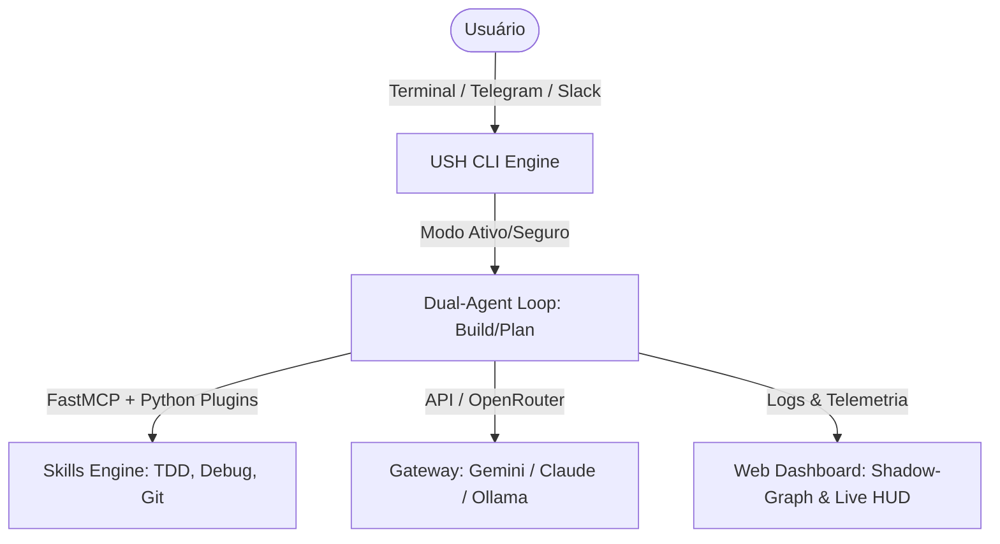

# 🧬 USH (Unified Shell) - Architectural Blueprint & Comparison

Este documento consolida uma análise detalhada dos projetos **OpenCode** e **OpenClaw**, extraindo o que há de melhor em cada arquitetura de CLI, interface de agente e design de usabilidade. Ele servirá como a especificação de fundação (Blueprint) para a nossa nova CLI (**USH**).

---

## 📊 Tabela Comparativa de Alto Nível

| Funcionalidade | 💻 OpenCode | 🦞 OpenClaw |
| :--- | :--- | :--- |
| **Foco Principal** | Desenvolvimento local e automação de código direto na IDE. | Assistente pessoal inteligente com automações multi-canal. |
| **Arquitetura** | Monorepo TypeScript (`bun`, `Effect`, `unstable/cli`). | Aplicação Dockerizada em Node.js com plugins em Python/JS. |
| **Interface Padrão** | CLI do terminal e aplicativo Desktop. | Interface Webchat, Telegram, WhatsApp, Discord, Slack. |
| **Modos de Agente** | Dual-Agent (`build` e `plan`) + `@general`. | Agente de execução livre guiado por regras estáticas. |
| **Gateway de IA** | APIs diretas (Anthropic/OpenAI) e provedores locais. | OpenRouter (acesso a 200+ modelos com 1 única API Key). |
| **Interface Visual** | Console local simples. | Live Canvas (A2UI) e canais de chat dinâmicos. |
| **Segurança** | Permissões de escrita na IDE. | Autenticação por token, pareamento e SSH/Tailscale. |

---

## 💻 1. Análise Profunda: OpenCode

O **OpenCode** destaca-se pelo seu rigor de execução local, velocidade e acoplamento direto com a pasta de desenvolvimento do usuário.

### 🌟 O Melhor do OpenCode:
1. **Modos de Agente Separados (Dual-Agent):**
   * **`build` mode:** Modo ativo com acesso irrestrito para criar/editar arquivos e rodar comandos do terminal.
   * **`plan` mode:** Modo de leitura segura (Read-only). Ideal para explorar projetos desconhecidos, pois recusa edições de arquivos e pede aprovação explícita para rodar qualquer bash.
2. **Subagentes Concorrentes (`@general`):**
   * Capacidade de delegar tarefas secundárias ou de pesquisa para subagentes em segundo plano sem travar o chat do usuário.
3. **Orquestração Funcional via Effect:**
   * Uso de programação funcional com a biblioteca `Effect` no TypeScript, garantindo gerenciamento de erros robusto, concorrência segura e injeção de dependências limpa.
4. **Integração com Git & PRs:**
   * Comandos nativos para criar branches, submeter Pull Requests no GitHub e analisar commits diretamente da CLI.

### 🛠️ Estrutura de Comandos CLI do OpenCode:
* `opencode run <prompt>`: Roda uma tarefa específica diretamente.
* `opencode serve`: Inicia o servidor e dashboard locais.
* `opencode agent`: Gerencia o ciclo de vida e estado do agente.
* `opencode mcp`: Instala e gerencia conexões e servidores MCP.
* `opencode pr`: Cria ou revisa Pull Requests diretamente pelo terminal.

---

## 🦞 2. Análise Profunda: OpenClaw

O **OpenClaw** destaca-se por sua flexibilidade de canais de comunicação, facilidade de uso diário de qualquer lugar (como o celular) e sua forte camada de segurança.

### 🌟 O Melhor do OpenClaw:
1. **Distribuição Multi-canal nativa:**
   * Você pode conversar com o seu agente de programação e enviar tarefas de qualquer lugar via **Telegram**, **WhatsApp**, **Discord** e **Slack**.
2. **OpenRouter como Gateway Unificado:**
   * Permite alternar instantaneamente entre mais de 200 modelos (GPT-4o, Claude 3.5 Sonnet, Gemini Pro, Llama 3.3) usando apenas uma chave de API, com suporte a modelos gratuitos (Qwen, Llama).
3. **Live Canvas (A2UI):**
   * Um ambiente web visual interativo onde o agente renderiza interfaces de usuário e mapas de projeto que reagem em tempo real.
4. **Pareamento de Segurança Tridimensional:**
   * Sistema de pareamento por código (`openclaw pairing approve telegram <code>`) que evita que usuários não autorizados usem suas chaves de API e acessem seus arquivos locais pelo chat de mensagens.

### 🛠️ Estrutura de Comandos & Comandos de Chat do OpenClaw:
* `/status`: Exibe modelo atual, consumo de tokens e custo da sessão.
* `/new` ou `/reset`: Limpa o histórico de chat e reseta a sessão.
* `/think <level>`: Controla o nível de raciocínio lógico do modelo.
* `/compact`: Compacta o histórico para economizar tokens.
* `openclaw pairing approve <channel> <code>`: Aprova um novo dispositivo/usuário no terminal.
* `openclaw doctor`: Varre a máquina buscando erros de configuração.

---

## 🧬 3. A Visão do USH (Unified Shell)

O **USH** será a consolidação perfeita desses dois mundos, unindo a força de desenvolvimento local do OpenCode com a portabilidade e automação rica do OpenClaw.

### 🚀 Pilares de Arquitetura do USH:

1. **Dual-Execution (Build vs Plan):**
   * A CLI iniciará por padrão no modo seguro (`plan`), analisando a codebase e traçando planos. O modo `build` executa as tarefas com confirmação humana ou sob regras estritas de TDD.
2. **Multi-Interface (Terminal local + Slack/Discord):**
   * Você pode interagir no terminal quando estiver na máquina, ou delegar tarefas complexas enviando uma mensagem no Discord/Slack pelo celular, recebendo a confirmação do término direto no chat.
3. **Dashboard Unificado (HUD + Shadow-Graph):**
   * Interface visual unificada com o HUD de acompanhamento em tempo real e o histórico Shadow-Graph de decisões arquiteturais do projeto.
4. **Skills Baseadas em Metodologia (Superpowers):**
   * Incorporar nativamente as regras de TDD Estrito, a Lei de Ferro do Debugging e o uso de Git Worktrees em Python no motor interno da CLI.
5. **Gateway de Modelos Flexível:**
   * Suporte nativo a OpenRouter (API Key única), chaves diretas (Gemini/Claude) e modelos offline via Ollama local.
